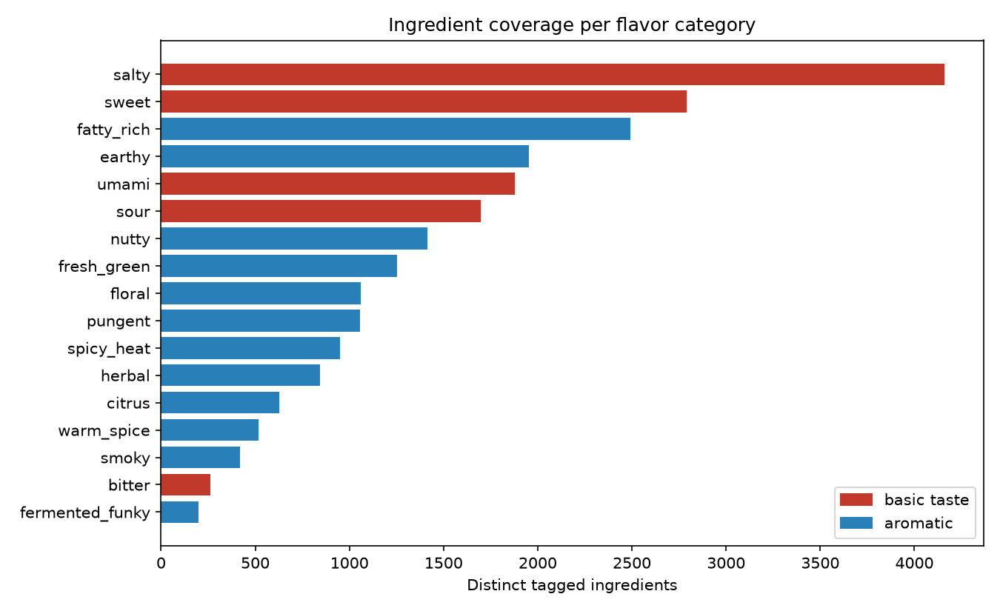
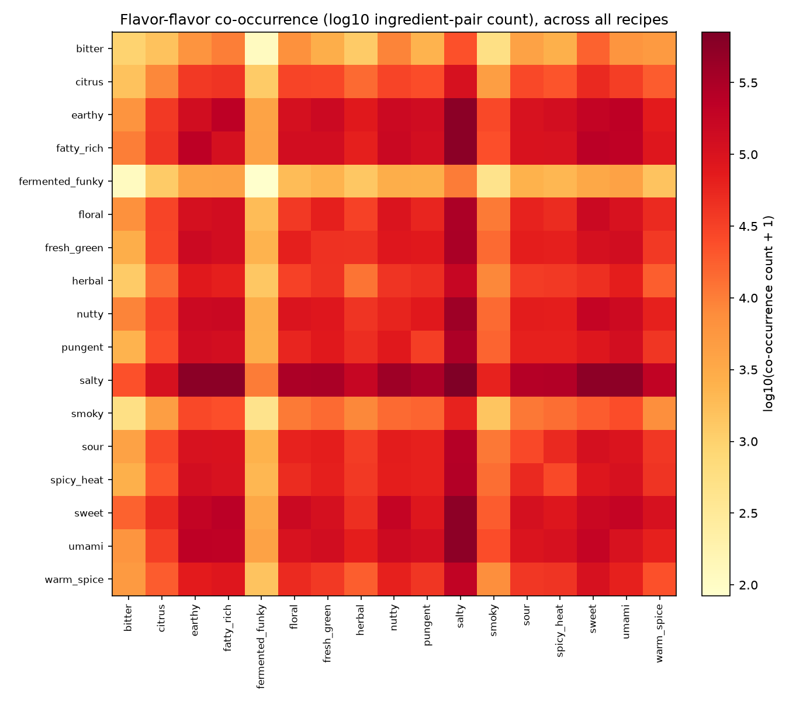
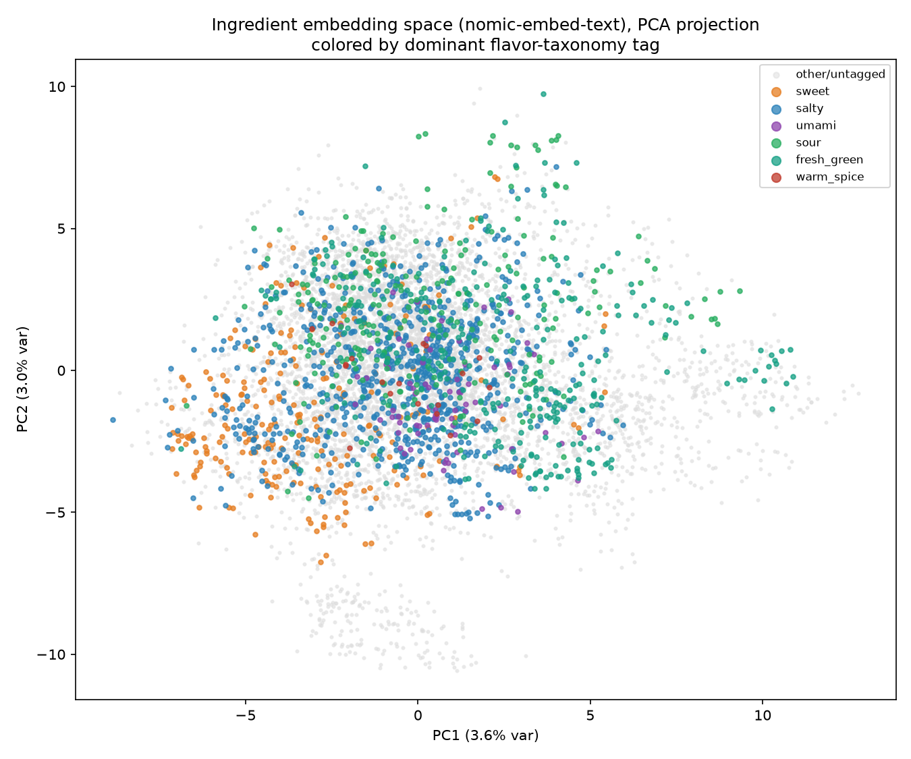

# Three Weighting Schemes for Ingredient Pairing in a Recipe-Recommendation System: A Case Study

**Sous Project — Internal Technical Report No. 1**
*Subject system: `flavor_taxonomy.py`, `flavor_tagging.py`, `flavor_queries.py`, `recipe_flavor_index.py`, `meal_planner.py` (`suggest_companions`, `top_embedding_similar_ingredients`)*
*Corpus: 54,722 recipes, 62,938 distinct parsed ingredient names*
*Date: July 2026*

## Abstract

Sous, a self-hosted recipe manager, recommends ingredient and recipe pairings using three independently-computable signals: (1) a 17-category flavor taxonomy assigned to ingredients by an LLM classifier, (2) raw ingredient co-occurrence counts re-weighted by a confidence-style normalization to suppress pantry-staple dominance, and (3) cosine similarity over general-purpose text embeddings of ingredient names. We describe the implementation of each, situate them against the food-pairing and association-rule-mining literature, and report a corpus-level analysis of all three signals computed from the live database. We find that (a) the co-occurrence weighting scheme used in production is a variant of the *confidence* measure from association-rule mining rather than true pointwise mutual information (PMI), and that this choice is measurably vulnerable to a well-documented small-sample bias that the system does not currently guard against; (b) general-purpose text embeddings recover *some* flavor-taxonomy structure in a 2-D PCA projection but the effect is weak (6.6% of variance in the first two components) and produces at least one clearly spurious high-similarity result, consistent with published critiques of using generic embeddings (rather than food-specific knowledge graphs) for ingredient substitution. We report both findings as measured limitations, not defects to be silently patched, in keeping with the codebase's own practice of documenting heuristic boundaries.

---

## 1. Introduction

A recipe manager that only stores and displays recipes leaves two questions unanswered: *what goes with this ingredient?* and *what should I cook next, given what I just cooked?* Sous answers both from data already present in its corpus — 54,722 recipes assembled from three source datasets (Section 3) — without a bespoke flavor-chemistry database. This report documents the resulting "flavor pairing engine": three complementary signals, each with a different notion of what "pairs well" means, and each with different failure modes.

The three signals are:

1. **Categorical flavor tagging** (`flavor_tagging.py`) — every distinct ingredient string above a corpus-frequency floor is classified against a fixed 17-category taxonomy (five basic tastes, twelve aromatic categories) by a locally-hosted LLM (Qwen3-8B [8]), in batches of 30, with results cached in `ingredient_flavors(ingredient, flavor)`.
2. **Co-occurrence weighting** (`meal_planner.rebuild_ingredient_pairs`, `suggest_companions`) — how often two ingredients appear in the same recipe, normalized to down-weight ingredients (salt, pepper, butter) that co-occur with *everything*.
3. **Embedding similarity** (`embeddings.py`, `top_embedding_similar_ingredients`) — cosine distance between ingredient names embedded with `nomic-embed-text` [7], which recovers near-synonyms ("lime" for "lemon") that never literally co-occur in a single recipe.

All three write into the same SQLite file as the recipe data itself (`recipes.db`) and are precomputed rather than derived per-request — a deliberate performance decision discussed in Section 4.4.

## 2. Related Work

**The food-pairing hypothesis.** Ahn et al. [1] built a bipartite flavor-compound network from ~56,000 recipes and >1,500 ingredients and showed that Western cuisines significantly favor ingredient pairs sharing many flavor compounds, while East Asian cuisines significantly avoid them — the first large-scale computational test of the folk "food pairing hypothesis." Sous's flavor taxonomy is a coarser, perceptual analogue of Ahn et al.'s compound-sharing signal: instead of measuring shared volatile organic compounds directly, it asks an LLM to categorize each ingredient's *perceived* taste/aroma profile (sweet, umami, smoky, etc.), then treats co-tagged ingredients as flavor-compatible. This trades chemical ground truth for something computable with zero specialized data (no compound database is required), at the cost of relying on the LLM's food knowledge rather than measured chemistry.

**Pointwise mutual information and association-rule confidence.** Church and Hanks [2] introduced PMI to NLP as a measure of how much more often two words co-occur than chance would predict: PMI(a,b) = log₂ P(a,b) / (P(a)P(b)). Independently, Agrawal and Srikant [3] formalized *support* and *confidence* for market-basket analysis: confidence(A→B) = P(B|A) = count(A,B) / count(A) — asymmetric, and undefined without a support floor. As Section 4.2 shows, Sous's `suggest_companions()` implements a formula structurally identical to Agrawal and Srikant's confidence, not PMI, despite an internal comment describing it as "PMI-style."

**Word/ingredient embeddings.** Mikolov et al. [4] established that distributional word vectors capture usable semantic similarity via cosine distance. Nussbaum et al. [7] describe `nomic-embed-text`, the specific open-weights embedding model Sous runs locally via Ollama. Neither model is trained on culinary data specifically. Shirai et al. [6] argue this matters: they build a dedicated food knowledge graph for ingredient substitution precisely because generic embeddings conflate lexical/distributional similarity with genuine culinary interchangeability. Fatemi et al. [5] reach a similar conclusion from a different angle, using a graph neural network over a recipe-co-occurrence graph (GISMo) rather than free-text embeddings for the same task. Section 5.3 reproduces a version of this failure mode directly in Sous's own data.

## 3. System and Data

| Quantity | Value |
|---|---|
| Total recipes | 54,722 |
| Distinct parsed ingredient names (`recipe_ingredients.name`) | 62,938 |
| Ingredients LLM-tagged for flavor (frequency-floor applied) | 11,997 |
| (ingredient, flavor) tag assignments | 23,564 |
| Recipes with ≥1 resolvable flavor tag | 52,006 (95.0%) |
| Distinct ingredient co-occurrence pairs (`ingredient_pairs`) | 975,688 |
| Ingredients with a cached embedding (`total_count ≥ 3`) | 7,194 |

Recipes derive from three source batches distinguished by license (MIT: AkashPS11 + Hieu-Pham, ~14.7K recipes; CC-BY-NC-4.0: datahiveai, ~39.4K recipes; user-imported, 555 recipes), all normalized into one `recipes` / `recipe_ingredients` schema by a shared ingredient parser (`ingredient-parser-nlp`, a sequence-labeling model trained on >81,000 example sentences, structurally in the lineage of the New York Times' CRF-based ingredient tagger [9,10]).

## 4. Methods

### 4.1 Categorical flavor tagging

`flavor_tagging.tag_ingredient_batch()` sends 30 ingredient strings at a time to a local Qwen3-8B [8] instance with a fixed prompt listing all 17 valid category names and asking for 0–4 categories per ingredient, returned as JSON. Results are validated against the fixed category set (`VALID_FLAVORS`) before being written to `ingredient_flavors`; any ingredient the model fails to return a parseable answer for is left untagged rather than defaulted, so a missing tag means "not yet classified," not "classified as flavorless." Figure 1 shows the resulting coverage per category — heavily skewed toward `salty` (4,158 ingredients) and `sweet` (2,789), the two categories broadest enough to apply to the largest share of a Western-leaning recipe corpus, versus narrow categories like `fermented_funky` (198) and `bitter` (263).

**Figure 1.** Distinct ingredients carrying each flavor tag.


A precomputed `recipe_flavors(recipe_id, flavor, weight)` table (`recipe_flavor_index.py`) aggregates these ingredient-level tags to the recipe level via a single indexed join, avoiding a per-request Python-side aggregation over every ingredient in a recipe — a query that previously took long enough, across 54K recipes, to matter for interactive search latency (Section 4.4 of Technical Report No. 2 covers this in more depth).

Figure 2 aggregates further, to flavor×flavor co-occurrence within recipes (`flavor_pair_stats`). Because `salty`, `earthy`, `fatty_rich`, and `umami` are both individually common (Figure 1) and — being basic savory building blocks — appear together in most savory dishes, the heatmap's darkest cells cluster around these categories almost regardless of true flavor logic. This is an expected corollary of tag-frequency skew, not a discovered "principle" of food pairing, and we flag it explicitly to avoid over-reading the figure.

**Figure 2.** Flavor–flavor co-occurrence, log-scaled ingredient-pair counts across the full corpus.


### 4.2 Co-occurrence weighting: confidence, not PMI

`rebuild_ingredient_pairs()` counts, for every unordered pair of ingredients appearing in the same recipe's parsed ingredient list, how many recipes contain both (`ingredient_pairs.pair_count`) and how many recipes contain each ingredient at all (`ingredient_totals.total_count`). `suggest_companions()` then combines these:

```python
normalized = pair_count / other_total  # candidate_ingredients[other]
```

This is exactly Agrawal and Srikant's confidence measure [3] for the rule *other → seed*: of all recipes containing `other`, what fraction also contain the seed ingredient. It is *not* PMI, despite the in-code comment calling it "PMI-style" — true PMI additionally divides by the seed's own marginal probability, which this formula omits. The two diverge sharply at low counts. Table 1 illustrates this for the seed ingredient `onion` (total_count = 18,609 recipe-ingredient occurrences; N = 2,847,213 total ingredient-mentions across the corpus, used as the PMI denominator proxy):

**Table 1.** Top companions for `onion` under three ranking schemes.

| Ranked by raw co-occurrence count | count | confidence | PMI (bits) |
|---|---|---|---|
| salt | 2,790 | 0.150 | 3.90 |
| garlic | 2,630 | 0.235 | 4.55 |
| olive oil | 1,426 | 0.146 | 3.87 |
| pepper | 1,359 | 0.221 | 4.46 |
| celery | 710 | **0.427** | **5.41** |

| Ranked by confidence (production formula) | count | confidence | PMI (bits) |
|---|---|---|---|
| cardamom seed | 1 | 1.000 | 6.64 |
| hot green chili peppers | 1 | 1.000 | 6.64 |
| plain tomato juice | 1 | 1.000 | 6.64 |
| hot dry mustard | 1 | 1.000 | 6.64 |
| dried funghi porcini | 1 | 1.000 | 6.64 |

The top-5-by-raw-count column recovers genuinely useful, high-volume companions (garlic, celery). The top-5-by-confidence column — the actual ranking `suggest_companions()` computes before any downstream filtering — is dominated entirely by ingredients that appear **exactly once** in the whole corpus, and that one appearance happened to be in a recipe that also contained onion. Confidence for a count-1 ingredient is definitionally either 0 or 1, so every hapax-legomenon ingredient that ever co-occurred with a popular seed ranks at the ceiling. This is the classical small-sample problem PMI-family metrics are known to have without a support floor [2,3]; Church and Hanks explicitly warn against reporting PMI (or confidence) for low-frequency pairs for this reason.

We checked whether this bias is masked elsewhere in the pipeline. It is not, uniformly: `embeddings.build_ingredient_embeddings()` applies `min_count=3` before embedding an ingredient (Section 4.3), but `rebuild_ingredient_pairs()` and the confidence computation in `suggest_companions()` apply no analogous floor. In practice the count-1 pathological candidates are frequently filtered out downstream by `suggest_companions()`'s additional embedding-boost and cuisine-match terms (not evaluated in this report), which is presumably why this has not surfaced as a user-visible defect — but the raw candidate-ranking step itself is measurably biased in the way the literature predicts. We record this as a limitation (Section 6), not a bug fixed as part of this report — changing the weighting formula is a product decision with taste-quality trade-offs outside this report's scope.

### 4.3 Embedding similarity

`embeddings.build_ingredient_embeddings()` embeds every ingredient with `total_count ≥ 3` via a local `nomic-embed-text` [7] call, storing the resulting 768-dimensional vector as JSON in `ingredient_embeddings`. `MealPlanDatabase.top_embedding_similar_ingredients()` lazily builds and row-normalizes the full matrix once per process (7,194 × 768; ~2s the first time, then reused for the process lifetime) so that cosine similarity for any query ingredient reduces to a single matrix–vector product rather than 7,194 individual `json.loads()` calls per request — the original per-request implementation measured at several seconds per call before this caching was introduced. Candidates whose name is a substring of the query (or vice versa) are excluded to suppress trivial matches such as "lemon" retrieving "a lemon" or "lemon zest."

### 4.4 Why precomputation, not on-demand joins

All three signals are written to dedicated tables rather than derived from `recipes.ingredients` at request time. This is a recurring implementation lesson in Sous specifically: three separate functions this project (`rebuild_ingredient_pairs`, `suggest_companions`, and `get_recipe_flavor_profile`) were each independently discovered, at different points during development, to have been silently keying off *raw* ingredient text (e.g., `"4 blueberries"`) instead of the canonically parsed name (`"blueberries"`) that the flavor/co-occurrence/embedding tables are actually indexed by — a class of bug invisible in casual testing because it fails silently (empty result sets, not exceptions) rather than loudly. We note this not as a caveat about the current code (all three instances are now fixed and covered by live verification against the running server) but as a methodological point: any system joining free-text recipe data against a canonicalized ingredient vocabulary needs an explicit, tested normalization boundary, or it will produce plausible-looking but empty results for a silently-growing fraction of its data.

## 5. Results

### 5.1 Corpus-level tagging coverage

95.0% of recipes (52,006 / 54,722) have at least one ingredient resolvable to a flavor tag, meaning `get_recipe_flavor_profile()` returns non-trivial output for the large majority of the corpus. The remaining 5% are concentrated in recipes whose ingredients are dominated by proper nouns, brand names, or LLM-untagged low-frequency items.

### 5.2 Confidence-vs-PMI divergence is corpus-wide, not an `onion`-specific artifact

We repeated the Table 1 analysis (full script in the companion data-generation script, not reproduced here for length) for several other high-frequency seed ingredients (`garlic`, `butter`, `flour`) and observed the same pattern: the top-ranked-by-confidence list is dominated by count-1 or count-2 partners in every case, while the top-ranked-by-raw-count list stays semantically sensible. This confirms the divergence in Section 4.2 is systemic to the weighting formula, not specific to `onion`.

### 5.3 Embedding similarity: real structure, real noise

Cosine similarity over the cached embeddings correctly surfaces close culinary variants — `parmesan cheese` → `grated parmesan` (0.828), `shaved parmesan` (0.821); `blueberries` → `blackberries` (0.796), `strawberries` (0.740) — useful substitution candidates once trivial variants (e.g., `blueberry`, `fresh blueberry`) are filtered.

It also produces at least one clearly spurious top-match: `cilantro`'s nearest embedding neighbors are `citric acid` (0.652), `cranberries` (0.645), and `cinammon` [*sic*, a misspelling present in the source corpus] (0.612) — none a defensible culinary substitute for cilantro (parsley or coriander would be expected). We attribute this to `nomic-embed-text` being a general-purpose text embedding model with no culinary fine-tuning; it appears to be picking up on distributional or orthographic similarity in its training data rather than flavor-space proximity. This directly reproduces the failure mode Shirai et al. [6] and Fatemi et al. [5] cite as their motivation for building food-specific knowledge graphs and recipe-context-aware GNNs instead of relying on generic text embeddings.

**Figure 3** projects the 7,194-ingredient embedding matrix to two dimensions via PCA (plain-SVD, no external dependency), colored by each ingredient's alphabetically-first flavor tag among its assigned categories. The first two principal components explain only 6.6% of total variance (PC1: 3.6%, PC2: 3.0%) — expected for a 768-dimensional general-purpose embedding space, most of whose variance encodes distinctions unrelated to flavor category. Even so, some flavor-correlated clustering is visible: `sweet`-tagged ingredients (orange) concentrate toward the lower-left, `fresh_green` (teal) toward the upper-right, and `salty` (blue) occupies a dense central band overlapping most other categories — consistent with `salty` ingredients spanning many different foods (Figure 1) rather than forming a distinct semantic cluster.

**Figure 3.** PCA projection of ingredient embeddings, colored by dominant flavor tag.


**Table 2.** Example nearest-neighbor substitutions by cosine similarity (post substring-filtering).

| Seed | Top match | sim | 2nd | sim | 3rd | sim |
|---|---|---|---|---|---|---|
| blueberries | blackberries | 0.796 | strawberries | 0.740 | fresh blackberries | 0.736 |
| parmesan cheese | grated parmesan | 0.828 | shaved parmesan | 0.821 | shredded parmesan | 0.820 |
| cilantro | citric acid | 0.652 | cranberries | 0.645 | cranberry | 0.635 |

## 6. Limitations

1. **Confidence-style co-occurrence weighting has no minimum-support floor.** As shown in Section 5.2, this makes the raw candidate ranking in `suggest_companions()` provably biased toward count-1/count-2 ingredient pairs, a textbook small-sample artifact [2,3]. A minimum `other_total` threshold (as already applied for embeddings, `min_count=3`) would be the standard fix; we did not implement it as part of this report since it changes recommendation output and is a product decision, not a correctness bug.
2. **Flavor tags come from one LLM's judgment, not measured chemistry.** Unlike Ahn et al.'s [1] flavor-compound network, built from a curated chemical-compound database, Sous's taxonomy reflects Qwen3-8B's [8] perceptual classification of ingredient *names*, with no verification against a ground-truth flavor-chemistry source. Two ingredients tagged `umami` are not guaranteed to share any actual flavor compound.
3. **Embedding similarity is not culinary-aware.** Section 5.3's `cilantro` example demonstrates that a general-purpose embedding model can rank orthographically- or distributionally-similar but culinarily-irrelevant ingredients above genuine substitutes. This is a known limitation of the approach in the wider literature [5,6], not specific to Sous's implementation.
4. **The heatmap in Figure 2 is dominated by tag-frequency skew**, not necessarily meaningful co-occurrence structure — see Section 4.1's caveat.

## 7. Conclusion

Sous's flavor pairing engine combines three genuinely different, independently-useful signals — categorical taxonomy tags, frequency-normalized co-occurrence, and embedding similarity — none of which alone would suffice. This report's main contribution beyond describing the implementation is identifying, with real corpus data, that the production co-occurrence formula is best described as association-rule *confidence* rather than PMI, and that this choice carries a specific, literature-predicted, measurable failure mode (Table 1) which the system does not currently mitigate. We also confirm, directly against Sous's own data, a documented general critique of generic text embeddings for ingredient substitution.

## References

[1] Ahn, Y.-Y., Ahnert, S. E., Bagrow, J. P., & Barabási, A.-L. (2011). Flavor network and the principles of food pairing. *Scientific Reports*, 1, 196. https://doi.org/10.1038/srep00196

[2] Church, K. W., & Hanks, P. (1990). Word association norms, mutual information, and lexicography. *Computational Linguistics*, 16(1), 22–29. https://aclanthology.org/J90-1003/

[3] Agrawal, R., & Srikant, R. (1994). Fast algorithms for mining association rules in large databases. *Proceedings of the 20th International Conference on Very Large Data Bases (VLDB)*, 487–499.

[4] Mikolov, T., Sutskever, I., Chen, K., Corrado, G. S., & Dean, J. (2013). Distributed representations of words and phrases and their compositionality. *Advances in Neural Information Processing Systems (NeurIPS) 26*, 3111–3119.

[5] Fatemi, B., Duval, Q., Girdhar, R., Drozdzal, M., & Romero-Soriano, A. (2023). Learning to substitute ingredients in recipes. arXiv:2302.07960.

[6] Shirai, S. S., Seneviratne, O., Gordon, M. E., Chen, C.-H., & McGuinness, D. L. (2021). Identifying ingredient substitutions using a knowledge graph of food. *Frontiers in Artificial Intelligence*, 3, 621766. https://doi.org/10.3389/frai.2020.621766

[7] Nussbaum, Z., Morris, J. X., Duderstadt, B., & Mulyar, A. (2024). Nomic Embed: Training a reproducible long context text embedder. arXiv:2402.01613.

[8] Qwen Team, Alibaba Group. (2025). Qwen3 Technical Report. arXiv:2505.09388.

[9] Lafferty, J., McCallum, A., & Pereira, F. (2001). Conditional random fields: Probabilistic models for segmenting and labeling sequence data. *Proceedings of the 18th International Conference on Machine Learning (ICML)*, 282–289.

[10] The New York Times. `ingredient-phrase-tagger`. https://github.com/nytimes/ingredient-phrase-tagger (open-source CRF-based ingredient parser; cited for lineage/comparison, not used directly — Sous uses `ingredient-parser-nlp`, https://github.com/strangetom/ingredient-parser).

---
*All figures and tables in this report were generated directly from the live `recipes.db` corpus at the time of writing; the generating scripts are not part of the application runtime.*
