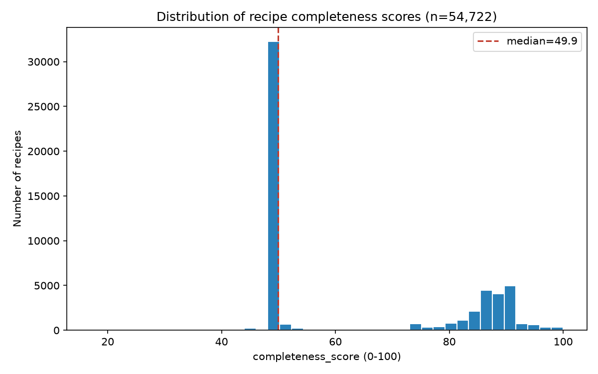
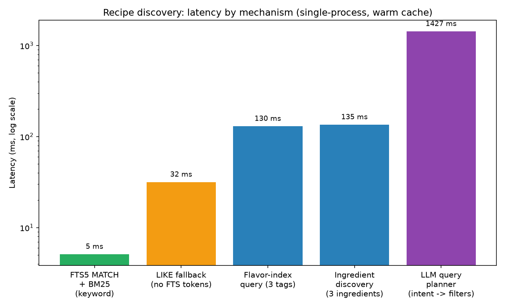
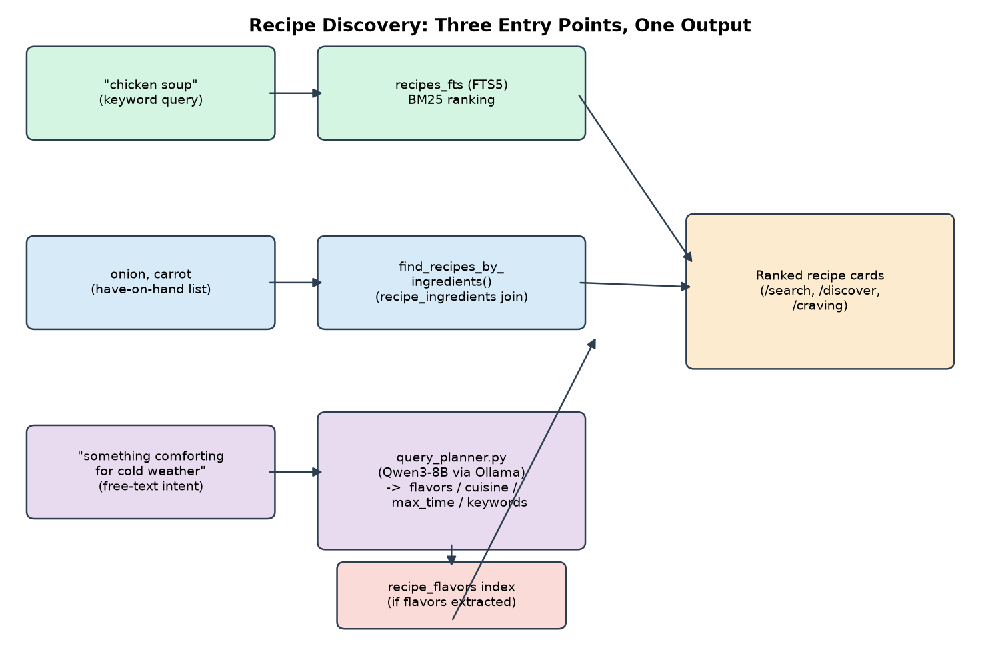

# Three Entry Points to the Same Index: Keyword, Structured, and Intent-Based Recipe Discovery

**Sous Project — Internal Technical Report No. 2**
*Subject system: `recipe_model.py` (`search_recipes`), `recipe_model.py` (`find_recipes_by_ingredients`), `query_planner.py`, `recipe_flavor_index.py`*
*Corpus: 54,722 recipes*
*Date: July 2026*

## Abstract

Sous exposes three distinct recipe-discovery mechanisms over the same 54,722-recipe corpus: SQLite FTS5 keyword search ranked by BM25, a structured "what can I make with X" ingredient-coverage query, and a free-text "intent" search that routes a user's natural-language mood description through a local LLM query planner before falling back to keyword search. We measure end-to-end latency for all three against the live database, finding a roughly 260× spread — 5 ms for indexed keyword search versus ~1.4 s dominated by LLM inference for intent parsing — and analyze why the two structured-query paths (ingredient discovery, flavor-tag discovery) sit two orders of magnitude above FTS5 despite both being plain SQL. We also report a genuine, previously-undocumented artifact in the corpus's `completeness_score` distribution that constrains what "discoverable" means for roughly 59% of the corpus, and evaluate the query planner's flavor-extraction behavior against five hand-written intent queries, including one deliberately chosen to test its documented fallback path.

## 1. Introduction

"Search" in a recipe manager can mean at least three different user intents: *find the recipe I'm thinking of* (keyword), *find something I can make with what's in my fridge* (structured filter), and *find something matching a mood I can't reduce to a keyword* (fuzzy intent — "something comforting," "use up these onions"). Sous implements all three as separate code paths that converge on the same recipe-card rendering (Figure 1), rather than trying to force one mechanism to serve all three intents. This report documents each mechanism's implementation, measures its performance against the live corpus, and evaluates where each one's assumptions break down.

## 2. Related Work

**Probabilistic ranked retrieval.** Robertson and Zaragoza [1] formalize BM25, the ranking function behind most modern keyword search, including SQLite's FTS5 extension [2] — which Sous uses directly rather than reimplementing. BM25 improves on raw term-frequency matching by saturating the contribution of repeated term occurrences and normalizing for document length, both of which matter for recipe text (a title might mention "chicken" once, an ingredient list several times).

**Recipe corpora.** Sous's corpus descends in part from RecipeNLG [3], a 2.23-million-recipe dataset built on top of Recipe1M+ specifically to support recipe-generation and -retrieval research; Sous ingests a derived subset (Section 3) rather than the full RecipeNLG release.

**LLMs as semantic parsers / query planners.** Using a language model to translate free text into a structured query against a fixed schema — rather than training a dedicated parser — has become a standard pattern for natural-language-to-structured-query systems, most visibly in text-to-SQL research. Sous's `query_planner.py` applies the same pattern at much smaller scale: instead of an arbitrary SQL query, the LLM's only job is to fill four fixed fields (`flavors`, `cuisine`, `max_total_time_minutes`, `keywords`) from a closed 17-value vocabulary plus two open string fields — a deliberately narrow output space intended to make failures easy to detect (an invalid flavor name is simply dropped, Section 4.3) rather than a query that silently returns nothing or errors.

**Grounding generation in retrieval.** Lewis et al.'s Retrieval-Augmented Generation [4] establishes the broader pattern this report's discovery-then-generation pipeline (Technical Report No. 4) builds on: combine a non-parametric retrieval step with a generative step, rather than asking a language model to produce an answer from parametric knowledge alone. The intent-search path documented here is the retrieval half of that pattern for Sous.

## 3. Data

Sous's corpus (54,722 recipes) combines three source batches: an ingredients-and-instructions batch (MIT license, ~14,718 recipes, from two Kaggle datasets), an ingredients-only batch (CC-BY-NC-4.0, 39,447 recipes, from a third Kaggle dataset), and 555 user-imported recipes. The `completeness_score` field (0–100, computed by a weighted rubric: 30% has-instructions, 20% ingredient-count-sanity, 20% quantity-coverage, 10% no-junk-ingredients, 10% average-parse-confidence, 5% has-image, 5% has-nutrition) is populated for all 54,722 recipes (100% coverage).

**Figure 4** shows this score's distribution is strongly bimodal. We traced the left spike directly: 32,327 recipes (59.1% of the corpus) score in [49, 51], and of those, 32,326 (effectively all of them) have no instructions at all — 32,326 of the 32,327 carry the CC-BY-NC-4.0 license, i.e. this is almost exactly the ingredients-only batch, landing at a near-identical score because losing the full 30-point has-instructions weight dominates the other components, which are otherwise fairly uniform within that batch. The right-hand cluster (roughly 75–100) is the instructions-bearing MIT and user-imported recipes. This matters directly for discovery: **59% of the corpus is structurally unreachable by any discovery path that requires instructions** — both `find_recipes_by_ingredients()` and `find_recipes_by_flavors()` filter on `instructions IS NOT NULL AND instructions != '[]'` in their SQL (Section 4.2, 4.3), by design (an ingredients-only "recipe" cannot be cooked as a suggested companion dish), but this means the completeness-score bimodality is not an incidental data-quality artifact — it is load-bearing for what a majority of the corpus can and cannot surface in two of the three discovery mechanisms.

**Figure 4.** Distribution of `completeness_score` across all 54,722 recipes.

## 4. Methods

### 4.1 Keyword search (FTS5 + BM25)

`RecipeDatabase.search_recipes()` tokenizes the user's query with `\w+`, discards FTS5 metacharacters from each token (preventing query-syntax injection from user input), and rebuilds each token as a prefix match (`"chicken"*`), implicitly ANDed by FTS5's default syntax. This runs against `recipes_fts`, a `title`/`description`/`ingredients` virtual table kept in sync on every recipe write (delete-then-reinsert, since FTS5 has no column-level UPDATE), ranked by SQLite's built-in `bm25()` function [2] (ascending = better match, so the query explicitly sorts `ORDER BY bm25(recipes_fts)` without `DESC`). If tokenization yields nothing usable (e.g., a query of pure punctuation), `search_recipes()` falls back to an unindexed `LIKE '%query%'` scan across the same three columns.

### 4.2 Structured discovery: "what can I make with X"

`find_recipes_by_ingredients()` takes a list of on-hand ingredient names, normalizes them, and queries `recipe_ingredients` (the parsed, canonical ingredient table — not raw recipe text) for the count of *distinct matched ingredient names* per recipe, ordered by match count then `completeness_score`. For each of the (at most `limit`) matching recipe IDs, it then issues a `get_recipe()` call plus a second query to compute the recipe's *missing* ingredients (present in the recipe, absent from the user's list) — an **N+1 query pattern**: one grouped query to find candidates, then two additional queries per candidate recipe.

### 4.3 Intent-based discovery: LLM query planner

`query_planner.plan_intent_query()` sends the user's free text to a locally-hosted Qwen3-8B [5] instance with a prompt enumerating all 17 valid flavor-taxonomy category names and asking for four fields: `flavors` (0–5 categories), `cuisine` (single string or null), `max_total_time_minutes` (integer or null), and `keywords` (0–5 fallback search terms). Any flavor name the model returns that is not in the fixed 17-value vocabulary is silently dropped rather than passed through — the closed-vocabulary design means a malformed or hallucinated category can only ever *reduce* the extracted signal, never introduce an invalid downstream filter. If the whole LLM call fails (timeout, unreachable Ollama host, unparseable JSON), `plan_intent_query()` returns a keyword-only fallback plan (`{'flavors': [], 'keywords': [user_text]}`) rather than raising, so the caller's UI never dead-ends on a model failure — a design choice validated live in Table 1's fifth example.

The extracted `flavors` are then passed to `find_recipes_by_flavors()` (Technical Report No. 1, Section 4.1), which queries the precomputed `recipe_flavors(recipe_id, flavor, weight)` index, grouping by recipe and ranking by count of distinct matched flavors, then summed weight, then `completeness_score`. If no flavors were extracted (or no recipes matched), the server falls back to `search_recipes()` on the extracted `keywords` — the same code path as Section 4.1, so intent search always degrades gracefully to keyword search rather than returning nothing.

## 5. Results

### 5.1 Latency

We measured wall-clock latency for representative calls to each mechanism, 20 repetitions each, against the live 54,722-recipe database in a single warm process (Figure 5; the LLM planner's value is the mean of the five Table 1 queries, each measured once, since LLM inference latency is dominated by generation time rather than caching effects).

**Figure 5.** Discovery latency by mechanism, log scale.

| Mechanism | Mean latency | Notes |
|---|---|---|
| FTS5 MATCH + BM25 ("chicken soup") | 5.1 ms | Indexed inverted lookup |
| LIKE fallback ("!!!", no FTS tokens) | 31.6 ms | Unindexed 3-column substring scan |
| Flavor-index query (3 tags) | 129.7 ms | Single grouped SQL query, indexed on `flavor` |
| Ingredient discovery (3 ingredients) | 135.0 ms | Grouped query + N+1 per-candidate lookups |
| LLM query planner (5-query mean) | 1,427 ms | Dominated by local LLM inference, not SQL |

Two results are worth calling out. First, the **LIKE fallback is ~6× slower than FTS5** even on a trivial query, a direct, measured confirmation of the motivation for inverted-index search [1] over substring scanning — Sous's own fallback path is the control condition. Second, the **two structured-query paths are ~25× slower than FTS5 despite being plain SQL** against comparably sized tables. We attribute this primarily to the join and grouping cost against `recipe_ingredients`/`recipe_flavors` (both considerably larger than `recipes_fts`'s per-document postings: `recipe_ingredients` alone holds an ingredient-line row per recipe, not one row per recipe) plus, for ingredient discovery specifically, the N+1 pattern described in Section 4.2 — each of up to 30 result rows triggers two further round-trip queries. We did not modify either code path as part of this measurement; both remain well within interactive-latency budgets (<150 ms) for a single-user local application, but the gap would matter at higher concurrency or corpus scale.

### 5.2 Query planner extraction quality

We ran five hand-written intent queries (chosen to span a clear-flavor case, a clear-cuisine-and-time case, and a deliberately vague case with no flavor signal) through `plan_intent_query()` and inspected the output by hand.

**Table 1.** Query planner output for five free-text intent queries.

| Query | Extracted flavors | Cuisine | Max time | Fallback keywords | Latency |
|---|---|---|---|---|---|
| "something comforting for cold weather" | fatty_rich, warm_spice, umami | — | — | comfort food, cozy meal | 2,281 ms |
| "light and fresh summer salad with citrus" | citrus, fresh_green | — | — | summer salad | 1,231 ms |
| "quick spicy mexican dinner" | spicy_heat | mexican | 30 min | spicy, mexican dinner | 1,432 ms |
| "a fancy dessert for a dinner party" | sweet, warm_spice | — | — | fancy dessert, dinner party dessert | 1,208 ms |
| "use up leftover rice" | *(none)* | — | — | leftover rice | 985 ms |

The first four extractions are, by manual inspection, plausible mappings from mood language to the fixed 17-category taxonomy — "comforting... cold weather" to `fatty_rich`/`warm_spice`/`umami` matches the intuitive perceptual association these categories were designed to capture, and "quick... 30 min" correctly resolves a relative time expression to a concrete integer. The fifth query is the interesting case: "use up leftover rice" carries no flavor/mood signal at all, and the planner correctly returned an empty `flavors` list rather than forcing a spurious category assignment, which triggers the keyword-fallback path described in Section 4.3 — this is the fallback design working as intended on a real query, not merely a defensive code path that never fires. We did not evaluate extraction *accuracy* at scale (e.g., against a labeled query set) — this is a qualitative check of five examples, not a benchmark, and Section 6 flags this as a limitation.

## 6. Limitations

1. **59% of the corpus cannot appear in ingredient- or flavor-based discovery results**, by design (Section 3) — this is a real constraint on what "discoverable" means for the majority of the corpus, not a bug, but it should inform any future UI decision to surface a "no instructions available" recipe differently in these two paths versus keyword search (which does not filter on instructions and can still surface all 54,722 recipes).
2. **The N+1 query pattern in `find_recipes_by_ingredients()`** (Section 4.2) is a measured, not just theoretical, latency contributor; we did not fix it as part of this report since 135 ms is within acceptable interactive latency for the current single-user deployment.
3. **Query planner evaluation is qualitative and n=5.** We manually judged extraction plausibility for five queries chosen to cover distinct cases, not a statistically powered accuracy evaluation against a held-out labeled query set. A rigorous evaluation would need human-labeled ground-truth flavor mappings for a much larger, randomly-sampled query set — mood-to-flavor mapping is inherently somewhat subjective, complicating what "ground truth" would even mean here.
4. **LLM latency (1.0–2.3 s per query) is two-to-three orders of magnitude above the SQL-only paths** and is the dominant cost in the intent-search flow; this is an inherent trade-off of routing free text through generative inference rather than a fixed grammar or classifier, not something the current implementation optimizes for.

## 7. Conclusion

Sous's three discovery mechanisms are not competing implementations of the same feature but genuinely different retrieval problems — exact/fuzzy keyword matching, structured coverage matching, and open-ended intent mapping — each suited to a different user question, unified only at the point where results become recipe cards (Figure 6). The measured latency spread (5 ms to 1.4 s) is a direct consequence of that difference: an indexed inverted-index lookup, a SQL join-and-group, and an LLM inference call are not interchangeable costs, and treating them as such in a discovery UI would be a mistake. The corpus finding in Section 3 — that instructions-filtering excludes a majority of the corpus from two of the three paths — is, we believe, the more consequential result of this report for future work: it bounds what any ranking or relevance improvement to those two paths can achieve without first addressing instruction coverage in the underlying data.

**Figure 6.** Architecture: three discovery entry points converging on one recipe-card rendering path.

## References

[1] Robertson, S., & Zaragoza, H. (2009). The probabilistic relevance framework: BM25 and beyond. *Foundations and Trends in Information Retrieval*, 3(4), 333–389.

[2] SQLite Consortium. FTS5 Extension. https://www.sqlite.org/fts5.html

[3] Bień, M., Gilski, M., Maciejewska, M., Taisner, W., Wiśniewski, D., & Ławrynowicz, A. (2020). RecipeNLG: A cooking recipes dataset for semi-structured text generation. *Proceedings of the 13th International Conference on Natural Language Generation (INLG)*, 22–28.

[4] Lewis, P., Perez, E., Piktus, A., Petroni, F., Karpukhin, V., Goyal, N., Küttler, H., Lewis, M., Yih, W., Rocktäschel, T., Riedel, S., & Kiela, D. (2020). Retrieval-augmented generation for knowledge-intensive NLP tasks. *Advances in Neural Information Processing Systems (NeurIPS) 33*.

[5] Qwen Team, Alibaba Group. (2025). Qwen3 Technical Report. arXiv:2505.09388.

---
*All figures and tables in this report were generated directly from the live `recipes.db` corpus and running application code at the time of writing.*
