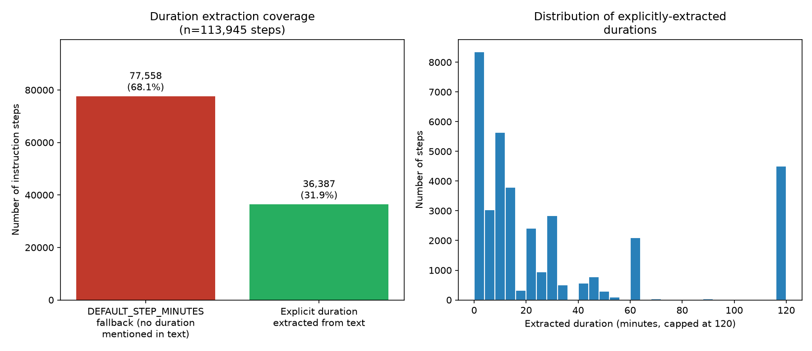
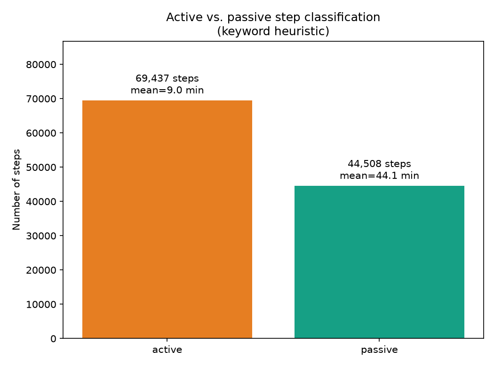
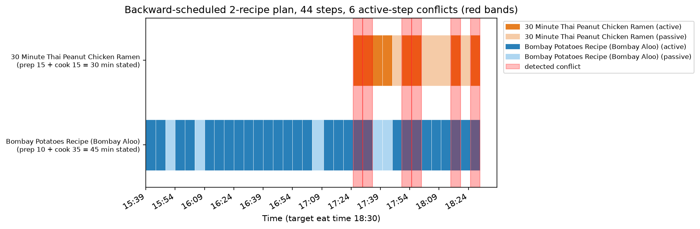

# Backward Scheduling from Free-Text Instructions: A Measurement of the Gap Between Heuristic and Ground Truth

**Sous Project — Internal Technical Report No. 3**
*Subject system: `meal_planner.py` (`extract_step_duration`, `classify_step_type`, `backward_schedule_recipe`, `backward_schedule_plan`)*
*Corpus: 113,945 cached instruction steps across 21,231 recipes*
*Date: July 2026*

## Abstract

Sous computes a per-step cooking schedule by working backward from a target eat time — the same backward-pass principle behind the Critical Path Method (CPM) [1,2] — using step durations and active/passive labels extracted from free-text recipe instructions by regex and keyword heuristics, since the underlying corpus carries no structured timing data. We report, for the first time against the live corpus, that **68.1% of the 113,945 cached instruction steps carry no explicit duration mention at all** and fall back to a fixed 5-minute default, and we demonstrate via a real two-recipe scheduling example that this default can silently dominate a schedule's total length: a 34-step recipe whose own `prep_time + cook_time` metadata states 45 minutes schedules to 171 minutes (a 3.8× inflation) once each under-specified step defaults to 5 minutes. We also verify that the system's cross-recipe conflict detector — a direct application of the classical interval-overlap-detection problem [3] — correctly identifies genuine active-step collisions in this same example. We conclude that the scheduling *algorithm* is sound and the *duration-extraction* layer beneath it is the dominant source of error, a distinction the current codebase's own documentation already anticipates but does not quantify.

## 1. Introduction

Cooking multiple dishes for one meal is a scheduling problem: several sequences of steps, some requiring continuous attention (active) and some running unattended (passive — baking, marinating, chilling), all needing to finish near the same target time. Sous addresses this with `backward_schedule_plan()`: given a meal plan (a set of recipes) and a target eat time, it walks each recipe's steps backward from the end, assigning start/end times, then merges every recipe's timeline and flags any two *active* steps (from different recipes) whose time windows overlap — the cook cannot stand at two stoves at once, but two *passive* steps (or one active, one passive) can safely coexist.

Two extraction problems sit upstream of the scheduling algorithm itself: how long does each step take, and is it active or passive? Sous's corpus has no structured timing data — recipes carry only `prep_time`/`cook_time`/`total_time` at the whole-recipe level, never per-step — so both are inferred from the free text of each instruction sentence by regex and keyword matching (`extract_step_duration`, `classify_step_type`). This report measures how often that inference succeeds, and what happens to the schedule when it does not.

## 2. Related Work

**Backward-pass scheduling.** Kelley and Walker's original CPM paper [1] and Kelley's subsequent mathematical formalization [2] introduced the *backward pass* — computing each activity's latest allowable start time by working from a fixed project completion date toward the start, exactly mirroring `backward_schedule_recipe()`'s walk from `eat_time` to the first step. CPM is normally applied to large multi-activity projects with known per-activity durations; Sous applies the same backward-pass logic at a much smaller scale (a handful of recipes, tens of steps) with *estimated*, not measured, durations — the core algorithmic idea transfers, but the input-quality assumptions CPM takes for granted (a project manager who knows how long each task takes) do not hold here.

**Interval scheduling and conflict detection.** Detecting whether any two time intervals in a set overlap is a textbook problem in algorithm design [3]; the canonical efficient solution sorts intervals and sweeps once, an O(n log n) approach. `backward_schedule_plan()`'s conflict detector instead compares every pair of active steps (O(n²) in the number of active steps across all recipes in a plan), which is appropriate at Sous's scale — a meal plan realistically holds a handful of recipes, tens of steps each — but would not scale to a CPM-sized project.

**Temporal expression extraction from text.** Recognizing and normalizing duration mentions in free text ("bake for 25 minutes," "let stand overnight") is a well-studied information-extraction task; the TimeML annotation scheme [4] formalizes this as tagging `TIMEX3` spans and normalizing them to ISO 8601 durations. Sous's `extract_step_duration()` solves a narrow version of the same problem with a single regex (`(\d+)(?:\s*(?:to|-)\s*\d+)?\s*(hour|hr|minute|min)s?\b`) plus a special case for the literal string "overnight" (mapped to 8 hours), rather than a general temporal-expression tagger — appropriate for a first-mention-wins heuristic over recipe instructions specifically, but narrower than TimeML's scope (e.g., it does not resolve relative expressions like "for the last 5 minutes" against an already-running duration, or ranges beyond the first match).

## 3. Methods

### 3.1 Duration extraction

`extract_step_duration(text)` checks for the literal substring "overnight" first (mapped to 480 minutes), then applies the regex above to the step text and returns the first match, converting hours to minutes. If nothing matches, it returns `DEFAULT_STEP_MINUTES = 5`. This is a genuinely acknowledged approximation — the module's own docstring states: *"Step durations and active/passive classification below are heuristic estimates (regex + keyword matching), not true recipe understanding. They're a genuinely useful approximation, not a guarantee."* This report supplies the quantitative measurement that claim did not previously have.

### 3.2 Active/passive classification

`classify_step_type(text)` checks the step text against a fixed list of 20 passive-indicating keywords (`bake`, `roast`, `simmer`, `marinate`, `chill`, `freeze`, `rest`, `rise`, `proof`, `cool`, `soak`, `steep`, `braise`, `slow cook`, `let stand`, `let sit`, `set aside`, `preheat`, among others) and labels the step `passive` if any appear, `active` otherwise (the default). Every recipe's step breakdown is computed once and cached in `recipe_steps(recipe_id, step_index, text, duration_minutes, step_type)`, self-healing (recomputed) if a recipe's instruction count later changes, and eagerly backfilled for all recipes with instructions at table-creation time rather than lazily filled on first request.

### 3.3 Backward scheduling and conflict detection

`backward_schedule_recipe(recipe, eat_time)` sums all step durations, subtracts the total from `eat_time` to get the first step's start time, then walks forward assigning `[start, start+duration]` to each step in sequence — every step in a single recipe is treated as strictly sequential, with no modeling of steps that could run in parallel *within* one recipe (e.g., "while the sauce simmers, chop the vegetables" is not detected as an opportunity to overlap two of that same recipe's own steps). `backward_schedule_plan(plan_id, eat_time)` runs this independently per recipe in the plan, concatenates all recipes' timelines, sorts by start time, then does a pairwise comparison of every two *active* steps from *different* recipes, flagging any whose `[start, end)` intervals overlap as a conflict — explicitly not attempting to auto-resolve conflicts by re-sequencing, only to surface them for the cook to resolve.

## 4. Results

### 4.1 Duration extraction coverage

Across all 113,945 cached steps (21,231 recipes with instructions), **68.1% (77,558 steps) have no explicit duration mention** and fall back to the 5-minute default; only 31.9% (36,387 steps) carry an extractable duration (Figure 7, left panel). Among the steps that *do* have an extractable duration, the distribution (Figure 7, right panel) is right-skewed with a strong secondary mode at 120 minutes (the plot's cap; this bucket includes the 1,425 steps matched to "overnight" → 480 minutes, clipped for readability, plus genuine 2-hour+ mentions), and a primary mode under 15 minutes consistent with typical active cooking steps ("saute for 5 minutes," "simmer 10-12 minutes").

**Figure 7.** Duration-extraction coverage (left) and the distribution of durations among steps where extraction succeeded (right).

### 4.2 Active/passive split

69,437 steps (60.9%) classify as active, 44,508 (39.1%) as passive (Figure 8). Passive steps have a substantially higher mean duration (44.1 min) than active steps (9.0 min) — consistent with the classification's intent, since passive keywords disproportionately match long unattended operations (baking, marinating, overnight rests) while active steps are typically short hands-on actions. Both classes share the same median (5 minutes, the default), which is expected given Section 4.1's finding that the default dominates step counts in both categories.

**Figure 8.** Step count and mean duration by active/passive classification.

### 4.3 A concrete schedule: algorithm correctness versus input-quality error

To see how default-duration dominance propagates into an actual schedule, we constructed a real two-recipe meal plan from the live corpus — *30 Minute Thai Peanut Chicken Ramen* (recipe metadata: `prep_time=15`, `cook_time=15`, 10 instruction steps) and *Bombay Potatoes Recipe (Bombay Aloo)* (`prep_time=10`, `cook_time=35`, 34 instruction steps) — and ran `backward_schedule_plan()` against a target eat time of 18:30.

**Figure 9.** Backward-scheduled timeline for the two-recipe plan, with the six detected active-step conflicts shaded red.

The scheduler correctly identified **6 active-step conflicts**, concentrated in the last ~65 minutes before the eat time where both recipes require simultaneous stovetop attention (Table 2) — a genuine, useful signal a cook planning this pairing would want.

**Table 2.** Detected conflicts (both recipes' overlapping active steps).

| Overlap window | Recipe A step | Recipe B step |
|---|---|---|
| 17:25–17:30 | Ramen: "INSTANT POT" | Potatoes: "Boil Potatoes" |
| 17:30–17:35 | Ramen: "combine chicken broth, coconut..." | Potatoes: "Wash the potatoes well..." |
| 17:50–17:55 | Ramen: "Ladle the soup into bowls..." | Potatoes: "Pour 2 tablespoons oil..." |
| 17:55–18:00 | Ramen: "STOVE TOP" | Potatoes: "Pour another tablespoon oil..." |
| 18:15–18:20 | Ramen: "Once done cooking, shred..." | Potatoes: "Transfer the fried potatoes..." |
| 18:25–18:30 | Ramen: "Ladle the soup into bowls..." | Potatoes: "Turn off the heat, garnish..." |

But the schedule's *start* time is where the duration-extraction limitation becomes visible end-to-end: the Bombay Potatoes recipe's 34 steps, each defaulting to 5 minutes wherever no duration was mentioned, sum to **171 minutes** of scheduled time — the timeline begins at 15:39 for an 18:30 eat time — despite the recipe's own `prep_time + cook_time` metadata stating **45 minutes** total. This is a 3.8× inflation, driven entirely by step *count* (34 short, mostly unmeasured instruction sentences) rather than any genuine long-duration step. A cook trusting this schedule's start time at face value would begin cooking roughly two hours earlier than the recipe author's own time estimate suggests is necessary. The scheduling *algorithm* — the backward walk and the conflict comparison — is doing exactly what it is specified to do; the error is entirely upstream, in treating "one instruction sentence" as a reasonable proxy for "one five-minute unit of work" when 68.1% of sentences (Section 4.1) carry no duration signal for the heuristic to extract in the first place.

## 5. Limitations

1. **The 5-minute default is not a neutral placeholder when steps are numerous.** Section 4.3 shows it can inflate a schedule by several multiples of the recipe's own stated time for instruction sets with many short, undated sentences (a common style in the corpus's non-U.S.-recipe-site sources, which tend toward granular numbered steps rather than a few longer paragraphs).
2. **Steps within a single recipe are scheduled strictly sequentially**, even when the instruction text itself implies parallelism ("while X simmers, do Y") — Sous makes no attempt to detect or exploit this, a design choice the codebase does not currently document as a limitation but which this report surfaces.
3. **Conflict detection is O(n²) in active-step count.** Acceptable at meal-plan scale (observed: 44 steps, low tens of active steps per plan) but not a general-purpose interval-scheduling algorithm; a sort-and-sweep approach [3] would be the standard replacement if plan sizes grew substantially.
4. **The regex duration extractor takes only the first time mention per step** and has no model of relative/compound durations (e.g., "the last 10 minutes of a 30-minute bake" would extract 10, not resolve against the containing 30-minute duration) — a narrower problem than general temporal-expression extraction as formalized in TimeML [4].
5. We did not evaluate active/passive classification accuracy against hand-labeled ground truth; Section 4.2's duration-by-class comparison is suggestive (passive steps are measurably longer) but not a substitute for a labeled accuracy figure.

## 6. Conclusion

Sous's backward-scheduling engine correctly implements the classical backward-pass and interval-overlap-detection ideas [1,2,3] it draws on, and the two-recipe example in Section 4.3 shows its conflict detector doing genuinely useful work. The measured limitation is not in that algorithm but in the 68.1%-uncovered duration-extraction layer beneath it (Section 4.1), whose effect on real schedules (Section 4.3, a 3.8× inflation on one concrete example) had not previously been quantified against the live corpus. We report this as confirmation of, and a specific number for, the honesty note already present in the source: the schedule is "a genuinely useful approximation, not a guarantee" — specifically, guaranteed to be no more precise than the free text it is extracted from allows.

## References

[1] Kelley, J. E., & Walker, M. R. (1959). Critical-path planning and scheduling. *Proceedings of the Eastern Joint Computer Conference*, 160–173.

[2] Kelley, J. E. (1961). Critical-path planning and scheduling: Mathematical basis. *Operations Research*, 9(3), 296–320.

[3] Kleinberg, J., & Tardos, É. (2005). *Algorithm Design*. Addison-Wesley. (Interval scheduling, Ch. 4.1.)

[4] Pustejovsky, J., Castaño, J., Ingria, R., Sauri, R., Gaizauskas, R., Setzer, A., & Katz, G. (2003). TimeML: Robust specification of event and temporal expressions in text. *New Directions in Question Answering*, 28–34.

---
*All figures and tables in this report were generated directly from the live `recipes.db` corpus and running application code (`meal_planner.py`) at the time of writing, including a real two-recipe backward schedule computed by the unmodified production function.*
