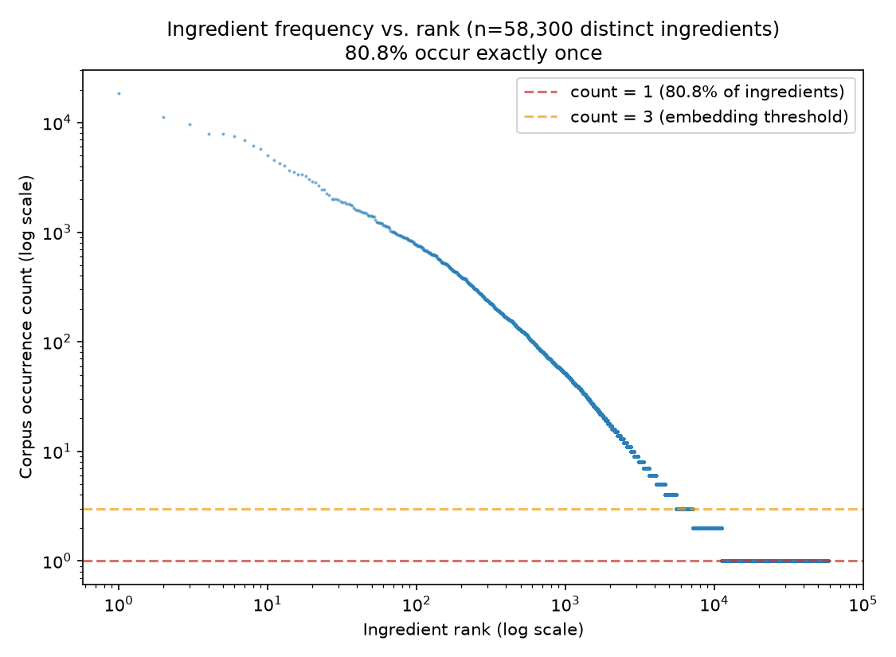
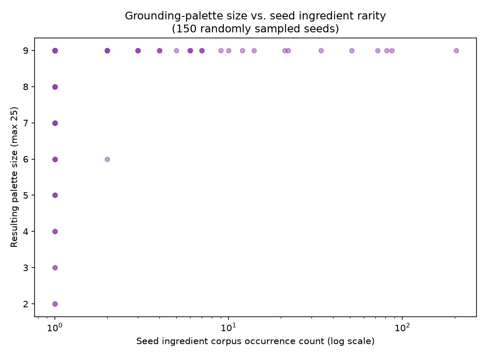
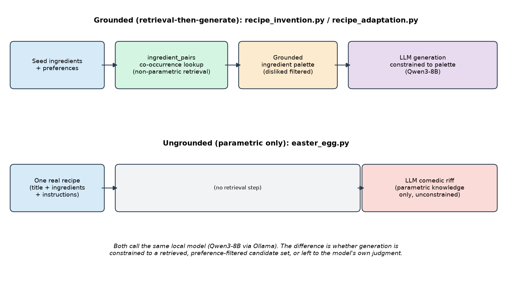

# Grounding Generative Recipe Adaptation and Invention in Corpus Statistics

**Sous Project — Internal Technical Report No. 4**
*Subject system: `recipe_adaptation.py`, `recipe_invention.py`, `preferences.py`, contrasted with `easter_egg.py`*
*Corpus: 54,722 recipes, 58,300 ingredients with co-occurrence data*
*Date: July 2026*

## Abstract

Sous generates two kinds of new recipe text with an LLM: a comedic riff on an existing recipe (`easter_egg.py`, present in the codebase prior to this report) and, newly, preference-aware ingredient substitution, full recipe adaptation, and grounded recipe invention (`recipe_adaptation.py`, `recipe_invention.py`). The new features constrain generation to a candidate ingredient set retrieved from real co-occurrence statistics before any text is generated — structurally the same retrieval-then-generate pattern as Retrieval-Augmented Generation [4], applied to structured tabular co-occurrence data rather than a text corpus. We report real end-to-end traces of substitution, adaptation, and invention against the live system and local model (Qwen3-8B), and quantify the grounding data's own limitation: 80.8% of the corpus's 58,300 distinct ingredients occur exactly once, a textbook Zipfian long tail [5], and we trace one concrete failure case (a two-ingredient palette) to its root cause — not ingredient rarity in general, as we initially hypothesized, but a specific under-parsed source recipe with only two extractable ingredients. This correction, arrived at by testing the hypothesis against 150 randomly sampled seed ingredients rather than accepting the single anecdotal case, is reported as a demonstration of why aggregate measurement matters over single-example reasoning in this kind of system evaluation.

## 1. Introduction

Two of Sous's generative features ask an LLM to produce recipe text that did not exist before: "adapt this recipe to respect my household's preferences" and "invent a recipe from the ingredients I have." A third, pre-existing feature (`easter_egg.py`) asks an LLM to riff comedically on an existing recipe. All three call the same locally-hosted model. The difference this report documents is architectural, not model-based: the two new features retrieve a candidate ingredient set from the corpus's own co-occurrence and embedding-similarity data (Technical Report No. 1) before generating, and constrain the prompt to draw primarily from that set; the comedic riff has no retrieval step and relies entirely on the model's own (unconstrained, unverified) culinary judgment — appropriately, since its explicit goal is absurdist comedy, not a usable recipe (Figure 12).

## 2. Related Work

**Retrieval-augmented generation.** Lewis et al. [4] formalize combining a non-parametric retrieval step with a parametric generation step so the model's output is grounded in retrieved evidence rather than relying solely on what it memorized during training. Sous's invention pipeline applies the same structural idea with a domain-specific retrieval source (a co-occurrence table, not a document index) — arguably a more literal application of "retrieval" than most RAG systems, since the retrieved palette is inserted directly into the prompt as an explicit constraint ("draw most ingredients from this list") rather than as unstructured supporting context.

**Ingredient substitution as a distinct ML problem.** Fatemi et al. [1] built GISMo, a graph neural network that ranks ingredient substitutions using both recipe-specific context and a generic ingredient-relation graph, on the premise that substitution quality depends on more than raw textual or embedding similarity. Senath et al. [2] fine-tune LLMs specifically for ingredient substitution via supervised fine-tuning and direct preference optimization, reporting the best configuration (fine-tuned + DPO Mistral-7B) achieves Hit@1 = 22.04 on the Recipe1MSub benchmark — a useful anchor for how hard this task is even with dedicated fine-tuning, and a reminder that Sous's approach (a general-purpose local LLM constrained by a co-occurrence-derived candidate list, zero fine-tuning) should not be assumed to match specialized-model accuracy.

**Zipf's law and long-tail data.** Zipf [5] documented the inverse rank-frequency relationship now named for him across natural language corpora; the same shape recurs whenever discrete items are drawn from real-world usage with a small number of very common items and a long tail of rare ones. Section 5.1 confirms this shape holds for Sous's ingredient corpus and traces its direct consequence for grounding data availability.

## 3. Methods

### 3.1 Preferences as a grounding constraint

`preferences.py` (Technical Report — not separately numbered, referenced here as the shared substrate) stores one household-level record: a list of dietary restrictions, a list of disliked ingredients, and free-text notes. `recipe_adaptation.suggest_substitutions()` and `recipe_invention.build_ingredient_palette()` both filter the disliked-ingredients list out of any candidate set *before* it reaches the LLM prompt — the model is never asked to avoid an ingredient after the fact; it is simply never shown one as an option.

### 3.2 Embedding-based substitution suggestion

`suggest_substitutions(recipe_id, meal_db)` identifies which of a recipe's canonical ingredients are on the disliked list, then calls `top_embedding_similar_ingredients()` (Technical Report No. 1, Section 4.3) for each, filtering out both disliked candidates and near-duplicates of the original ingredient. The near-duplicate filter required an addition beyond what Technical Report No. 1 already used: cosine-similarity substring filtering alone does not catch plural mismatches (`"blueberries"` is not a substring of `"blueberry"` or vice versa, since the endings diverge), so `_same_ingredient()` adds a small stemmer (`-ies → -y`, `-es → ε`, `-s → ε`) before the substring check. Without it, `suggest_substitutions()` for a disliked `"blueberries"` returned `"blueberry"`, `"fresh blueberry"`, `"dried blueberry"` as its top three "substitutes" — the same ingredient three ways, not alternatives.

### 3.3 Full recipe adaptation

`adapt_recipe_to_preferences(recipe)` sends the complete original recipe (title, ingredients, instructions) plus the household's preferences to the LLM, instructing it to make "the smallest changes that satisfy the preferences," explicitly framed as editing an existing recipe rather than inventing one. It returns `None` (not an exception, and not a degraded partial result) if no preferences are set or the LLM call fails for any reason, so the caller can distinguish "nothing to adapt" from "adaptation succeeded" without inspecting exception types.

### 3.4 Grounded invention

`invent_recipe(seed_ingredients, mood)` has two entry paths. If seed ingredients are given directly, `build_ingredient_palette()` expands them via `top_pairs_for_ingredient()` (real co-occurrence, Technical Report No. 1, Section 4.2) into a candidate list capped at 25 ingredients, always including the seeds themselves (assuming they are not disliked) ranked above their derived companions. If no seeds are given but a mood is ("something warm and comforting"), `_seed_ingredients_from_mood()` first calls the same flavor-extraction query planner built for intent search (Technical Report No. 2, Section 4.3) to get flavor categories, then picks the most corpus-frequent ingredient(s) tagged with each flavor as synthetic seeds — reusing the intent-search pipeline as a seed generator for invention, rather than building a second mood-to-ingredient mapping. The resulting palette, plus preferences, is sent to the LLM with an explicit instruction to draw most ingredients from the palette and add only "basic pantry staples" (salt, oil, water, flour) beyond it — a soft constraint, not a hard filter on the model's output, since nothing in the implementation validates post hoc that the returned recipe actually stayed within the palette (Section 6).

## 4. Results: real traces

We ran each of the three features live against the running system and record the unedited output here.

**Table 3. Substitution suggestion** for a disliked ingredient, recipe *Low-Fat Berry Blue Frozen Dessert* (id 1226), preferences: `disliked_ingredients=["blueberries"]`.

| Disliked ingredient | Suggested substitutes (cosine similarity) |
|---|---|
| blueberries | blackberries (0.796), strawberries (0.740), fresh blackberries (0.736) |

**Table 4. Full adaptation** of the same recipe, preferences: `disliked_ingredients=["blueberries"]`, `notes="make it dairy-free if possible"`.

| | Original | Adapted |
|---|---|---|
| Title | Low-Fat Berry Blue Frozen Dessert | Low-Fat Berry Blue Frozen Dessert (Dairy-Free) |
| Ingredients | 4 blueberries; 1/4 granulated sugar; 1 vanilla yogurt; 1 lemon juice | 4 **blackberries**; 1/4 granulated sugar; 1 vanilla yogurt **(dairy-free)**; 1 lemon juice |
| Changes summary (model's own words) | — | "Replaced blueberries with blackberries to accommodate the household's dislike of blueberries. Substituted regular vanilla yogurt with a dairy-free version to meet the dairy-free requirement." |

The model correctly resolved *two* independent constraints (a disliked ingredient and a free-text dietary note) in one pass, and its ingredient substitution matches the top embedding-similarity candidate from Table 3, though nothing in the implementation forces this consistency — the adaptation call and the substitution-suggestion call are independent LLM invocations with no shared state beyond the same preferences record.

**Table 5. Grounded invention** from seed ingredients `["onion", "chickpeas"]`, no disliked ingredients set.

Grounded palette (via `build_ingredient_palette`, real co-occurrence data): `onion, chickpeas, salt, garlic, olive oil, pepper, black pepper, water, celery, butter, cumin, lemon juice`

Generated recipe: *"Crispy Chickpea & Onion Stew"* — description: *"A warm and comforting stew that highlights the earthy sweetness of chickpeas and caramelized onions, finished with a zesty lemon kick."* Ingredients: diced onion, cooked chickpeas, minced garlic, olive oil, ground cumin, black pepper, salt, water, lemon juice — **every ingredient in the generated recipe is drawn from the retrieved palette**, with no unrelated additions, in this trace. Cuisine tag: "Mediterranean" (not present in the palette; inferred by the model from the ingredient combination, which is a reasonable inference — chickpea, cumin, and lemon juice together are a plausible Mediterranean/Middle Eastern signature — but is not itself grounded in retrieved data).

We repeated invention with `disliked_ingredients=["garlic", "cumin"]` set beforehand and confirmed both were absent from the regenerated palette before the LLM ever saw it (`onion, chickpeas, salt, olive oil, pepper, black pepper, water, celery, butter, lemon juice`) — the exclusion happens at retrieval time, not as a generation-time instruction the model could ignore.

## 5. Results: grounding-data coverage

### 5.1 The corpus is sharply Zipfian

Of 58,300 distinct ingredients with any recorded co-occurrence data, **80.8% (47,092) occur exactly once** in the entire 54,722-recipe corpus; only 5.0% occur 10 or more times (Figure 10). This is the same rank-frequency shape Zipf [5] documented for word frequency in natural-language text, here over ingredient mentions rather than words — expected for any large, naturally-accumulated food corpus (most dishes call for a small set of common staples, plus a long tail of dish-specific or regional ingredients that appear rarely).

**Figure 10.** Ingredient occurrence count vs. rank, log-log scale.

### 5.2 Palette size is largely insensitive to seed rarity — with one important exception

We initially hypothesized that rare seed ingredients (low `total_count`) would produce poorly-grounded, near-empty palettes, since fewer corpus occurrences should mean fewer recorded co-occurrence partners. To test this rather than rely on a single hand-picked example, we sampled 150 random ingredients from `ingredient_totals` and computed `build_ingredient_palette([seed])` for each (Figure 11).

**Figure 11.** Resulting palette size vs. seed ingredient corpus frequency, 150 random seeds.

The hypothesis was **not supported**: palette size clusters at the function's cap (9, given the default `top_n_per_seed=8` plus the seed itself) essentially independent of seed frequency across nearly the full sampled range, including seeds occurring only once. The mechanism is that `top_pairs_for_ingredient()` draws candidate companions from *every other ingredient that ever co-occurred with the seed in any recipe*, and a single recipe typically lists far more than eight ingredients — so even a seed appearing in exactly one recipe usually still yields up to eight companions from that one recipe's ingredient list, reaching the cap.

We then investigated why our original motivating example — the seed `"piloncillo cone"`, which produces a **2-ingredient palette** (itself plus `"nottingham dry yeast"`, and nothing else) — is an outlier against this pattern. Tracing it directly: `"piloncillo cone"` occurs in exactly one recipe (*Chicha Peruana*, id 1256), and that recipe's `recipe_ingredients` table contains **only two parsed ingredient rows total** — `"piloncillo cone"` and `"Nottingham dry yeast"` — despite Chicha Peruana (a fermented corn beverage) plausibly calling for more ingredients than that in its original source text. The degenerate palette is therefore not a direct consequence of the seed's rarity, but of that specific recipe's ingredient list being under-parsed to only two extractable names — a data-quality issue in the parsing pipeline (Technical Report No. 1's broader discussion of parsing correctness), not a property of ingredient rarity in general.

We report this as a corrected finding, not a discarded one: the *general* claim "rare seeds ground poorly" is false against 150 random samples, but the *specific* failure mode "a seed's only occurrence is in a badly-parsed recipe" is real and reproducible, and would not have been distinguishable from the general claim without testing both a single example and a larger random sample.

## 6. Limitations

1. **No post hoc validation that generated recipes actually stay within the retrieved palette.** Section 4's invention trace happened to use every palette ingredient and nothing else, but the prompt instruction ("draw most ingredients from this list... don't introduce unrelated main ingredients") is not enforced programmatically; an LLM output that ignored this instruction would not be caught or rejected.
2. **Adaptation and substitution-suggestion are independent LLM calls with no shared consistency guarantee.** Table 4's adaptation happened to match Table 3's top substitution candidate, but nothing in the code ties them together — a different sampling of the same model could adapt using a different (still valid, but inconsistent-with-the-suggestion-UI) substitute.
3. **Degenerate palettes are possible and traceable to specific data-quality causes** (Section 5.2), but the current implementation has no detection or fallback for this case — a seed whose only occurrence is under-parsed silently produces a near-empty palette rather than surfacing a warning or falling back to embedding similarity (Technical Report No. 1) as an alternate grounding source.
4. **Fine-tuned, task-specific models substantially outperform general-purpose LLMs on ingredient substitution specifically** [1,2] on their respective benchmarks; we make no claim that Sous's zero-fine-tuning approach matches that accuracy, only that it is grounded rather than freeform, which is a different (and weaker) claim than "accurate."
5. **The mood-to-seed-ingredient path (`_seed_ingredients_from_mood`) picks only the single most corpus-frequent ingredient per extracted flavor category**, which biases invented recipes from mood alone toward whatever ingredients happen to dominate each flavor tag's frequency count (Technical Report No. 1, Figure 1) rather than a diverse or representative sample.

## 7. Conclusion

The structural difference between Sous's grounded generation features and its pre-existing comedic-riff feature is not model quality but pipeline shape (Figure 12): retrieval-then-generate versus generate-only. Real traces (Section 4) show this constraint working correctly — disliked ingredients excluded before generation, not merely requested to be avoided; a generated recipe drawing entirely from its retrieved palette. The grounding data itself, however, inherits the same long-tailed sparsity documented for the wider ingredient vocabulary (Section 5.1), and while our corrected finding in Section 5.2 shows this sparsity does not typically translate into poor grounding for rare seeds, it can when a seed's sole occurrence is itself a poorly-parsed data point — tying this report's conclusions back to the ingredient-parsing correctness theme running through the whole flavor/discovery/adaptation stack this session's technical reports document.

**Figure 12.** Grounded (retrieval-then-generate) versus ungrounded (generate-only) architectures, both calling the same local model.

## References

[1] Fatemi, B., Duval, Q., Girdhar, R., Drozdzal, M., & Romero-Soriano, A. (2023). Learning to substitute ingredients in recipes. arXiv:2302.07960.

[2] Senath, T., Athukorala, K., Costa, R., Ranathunga, S., & Kaur, R. (2024). Large language models for ingredient substitution in food recipes using supervised fine-tuning and direct preference optimization. *Natural Language Processing Journal*. arXiv:2412.04922.

[3] Shirai, S. S., Seneviratne, O., Gordon, M. E., Chen, C.-H., & McGuinness, D. L. (2021). Identifying ingredient substitutions using a knowledge graph of food. *Frontiers in Artificial Intelligence*, 3, 621766.

[4] Lewis, P., Perez, E., Piktus, A., Petroni, F., Karpukhin, V., Goyal, N., Küttler, H., Lewis, M., Yih, W., Rocktäschel, T., Riedel, S., & Kiela, D. (2020). Retrieval-augmented generation for knowledge-intensive NLP tasks. *Advances in Neural Information Processing Systems (NeurIPS) 33*.

[5] Zipf, G. K. (1949). *Human Behavior and the Principle of Least Effort*. Addison-Wesley.

[6] Qwen Team, Alibaba Group. (2025). Qwen3 Technical Report. arXiv:2505.09388.

---
*All tables and traces in Section 4 reflect unedited output from live calls against the running Sous application and its local Qwen3-8B model at the time of writing; Section 5's figures were computed directly against the live `recipes.db` corpus, including a random 150-ingredient sample generated fresh for this report.*
